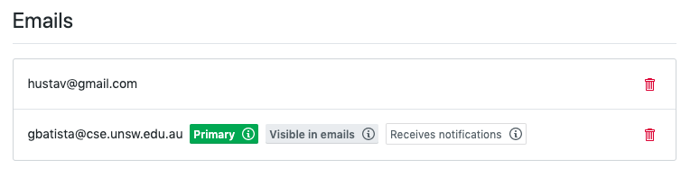
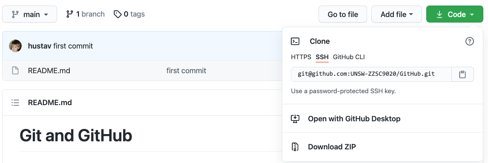
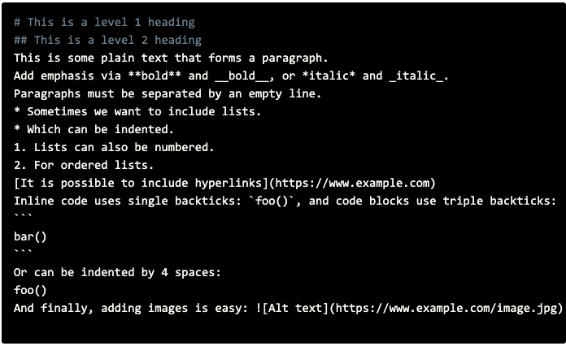

# Git and GitHub

This document is a brief introduction to some of the main git commands and the GitHub repository. This course will use GitHub as the primary repository for data and source code to support remote and distributed development. We will also use GitHub as a reference point, in which the groups will list all the project management, communication and development tools that they will use during the course. Each group will have its repository, and the course lectures will be part of the repository team. This setup will allow the lecturers to follow the project development and assist the groups with potential issues.

## Objectives

* Setup a private GitHub repository and configure it to be shared among the team members and course lecturers.
* Understand how a GitHub repository works and how to organise the course code, data and documentation using this tool
* Learn how to use git and GitHub main commands using the command line interface.

## GitHub Account

GitHub is a version control platform (like Bitbucket or GitLab) that uses git. It is an excellent way for developers to collaborate. During this course, the use of GitHub with a private repository is compulsory. GitHub will be the primary resource for code collaboration between the team members as well as the course lecturers. If you do not have a GitHub account associated with your UNSW institutional email, you will have to create an account before starting.

1. If you DON’T have a GitHub account, [join here](https://github.com/) using your institutional email. The student email (zID@student.unsw.edu.au) wil be necessary to join [GitHub Education](https://education.github.com/) later.
2. If you have a GitHub account but your email address does not belong to UNSW, you can add another email in the [settings page](https://github.com/settings/emails), as illustrated in the next figure.



Make sure to verify your email address. If you do not get an email straight away, go to [https://github.com/settings/emails](https://github.com/settings/emails) and click resend.

## SSH Key

There are two ways to authenticate with GitHub when you are working on your machine:

1. Use your username and password every time.
2. Authenticate using your SSH key which effectively links a particular machine to GitHub.

Option 1 can get quite tedious so we will be using the second option. If you are using Microsot Windows, skip steps 1 to 4 below, install [PuTTYgen](https://www.puttygen.com/) then use it for steps 5 and 6. Open a terminal and run the following commands in terminal (use the email you have used for GitHub):

1. `ssh-keygen -t rsa -C "github_email@example.com"`
2. Hit Enter three times to accept the default location and skip the password creation step. (You can ignore the output of this command)
3. cat ~/.ssh/id_rsa.pub
4. Copy the entire output of the above command, including the ssh-rsa at the start
5. Go to [https://github.com/settings/keys](https://github.com/settings/keys) and click New SSH Key
6. Enter your name as the title and paste the key (copied in the above step) into the text field. It should look something like below


## GitHub Education

[GitHub Education](https://education.github.com/) is a collection of tools and events freely available for students and teachers. One of the tools offered in the GitHub Student Developer Pack which includes a GitHub Pro account while you are a student. GitHub Pro accounts provide access to private repositories with more than three collaborators.  

Go to [GitHub Student Developer Pack](https://education.github.com/pack) and click on ``Get your pack'' button. Follow the instructions that include uploading a proof that your are currelty an UNSW student.


## Git installation

Throughout the course, you will need to be comfortable with git. It comes pre-installed on most Unix machines. To check if git is installed on your local machine use the command

`git status`

If it is installed, you will see something like

`fatal: Not a git repository (or any of the parent directories):`

If you do not have git installed, you will see something like

`bash: git: command not recognized`

If this is the case, you will have to set it up using the following instructions:

* Linux - Follow [these instructions](https://git-scm.com/download/linux)
* Mac - brew install git
* Windows - Follow [these instructions](https://git-scm.com/download/win)

Configure git if you have not used it before with the following commands (including the quotes):

```
git config --global user.name "Your Name"
git config --global user.email "github_email@example.com"
```

## Clone your first repo

Cloning a repo (a repo is just a directory that is linked with git) is how the codebase is linked from GitHub to your local computer so changes you make can be saved and shared with others. It is the step before you can start making changes and contributing. A repo can be cloned at any time by someone who has access, so they can start working whenever they want. When a repo is cloned, all code that is uploaded on the server is copied to a desired location on your local machine.

1. Click on the [repo link](Https://). You will be redirected to the repo page.
2. Click on the `Clone or download` green button.


3. If the title for the dropdown box is Clone with HTTPS click on the `Use SSH` link on the right. The box should look like the one below



4. Copy the link in the text box
5. Open a Terminal and navigate to the folder you want the repo to be in
6. `git clone [link]` (Replace `[link]` with the copied link from above step)
7. Type ls to ensure the folder has been copied correctly
8. `cd [repo_name]` to navigate into the cloned repo
9. Type ls again to see the copied files.

## Make your first commit

Now that you have cloned the repo, you are ready to work on the codebase locally.

A commit is an update of the remote (on the GitHub’s server) state of the repository. It saves changes that you have made and can be given a message to describe those changes. A good use of git involves many commits with detailed messages.

Before you can commit, you have to do what is called staging your changes, which effectively tells git what changes you want to commit and what changes you don’t at the moment.

Commits are often followed by pushing, which is how git uploads your commits to the remote server.

The commands to commit and push are as follows:

```
git add [files_to_commit] # Stage
git commit -m"Detailed message describing the changes" # Commit
git push # Push
```

Let's make a first commit by adding a Markdown file in the repo.

1. Create a blank file called HelloWorld.md in the repo directory
2. Add some Markdown text. Markdown is a markup language with plain text formatting syntax similar to HTML.

One straightforward example of Markdown file content is:

`# Hello World!`

However, you can explore more with a list of some common Markdown tags:



3. Go back to your terminal and enter the following commands:
4. `git add HelloWorld.md`
5. `git commit -m "Created first Markdown HelloWorld.md"`
6. `git push`
7. Go back to GitHub and confirm that your changes have been pushed to the server.

## Do your first pull

Usually, when you are using git, it is in a team. That means that you will not be the only one who is making the changes. If someone else makes a change and pushes it to the server, your local repo will not have the most up to date version of the files. Luckily, git makes it easy to update our local copy with the git pull command.

This command checks the remote server that your local repo is linked to and makes sure that all of your files are up to date. This ensures that you don’t accidentally do things like implementing the same thing someone else has already done and also lets you use other people’s work (e.g. new functions) when developing.

Pulling regularly is one of the most essential practices in git!

Unfortunately, at the moment, you are working individually. However, GitHub still gives us a nice way to practice a git pull.

1. View your repo on GitHub. 
2. Click on the HelloWorld.md file
3. Click the small ‘edit’ pencil icon in the top right
4. Add a Markdown text to the top of the file and click the ‘Commit Changes’ button at the bottom of the screen
5. This will have changed the HelloWorld.md file on the server but not on your local environment. To fetch these changes use the `git pull` command from your terminal
6. Confirm that your local version of HelloWorld.md now has the changes you made on the web page


## Create your first branch

Branches are a vital part of git and are used so people can work on separate parts of the codebase and not interfere with one another or risk breaking a product that is visible to the client. Breaking something on one branch does not have an impact on any other.

Proper use of git will involve separating parts of the project that can be worked on separately and having them in their own feature branch. These branches can then be merged when they are ready.

Useful commands for branches:

```
git checkout -b [new_branch_name] # Create a new branch and switch to it
git branch                        # List all current branches
git checkout [branch_name]        # Switch to an existing branch
```

1. Make your new branch with `git checkout -b first_new_branch`
2. List your branches to see that you have indeed swapped (use the above commands)
3. Open the HelloWorld.md file and add some more text
4. Try to push your changes to the server using the commands you learnt (git add, commit and push) in the Section "Make your first commit"
5. The above step should have given you the following error:

`fatal: The current branch first_new_branch has no upstream branch.`

This means that the branch you tried to make a change on doesn’t exist on the server yet, which makes sense because we only created it on our local machine.

6. To fix this, we need to add a copy of our branch on the server and link them up, so git knows that this new branch maps to a corresponding branch on the server

`git push -u origin first_new_branch`

Note: The final step above must be run on the 1st push to every new branch that you have created on your local machine. After you have run this once, you should go back to simply using `git push`

## Merge your two branches

Merging branches is used to combine the work done on two different branches and is where gits magic really comes in. Git will compare the changes done on both branches and decide (based on what changes were done to what sections of the file and when) what to keep. Merges are most often done when a feature branch is complete and ready to be integrated with the master branch.

Since we have finished all that we are going to do (and think there are no bugs) on our first_new_branch we can merge it back into master. It is a strong recommendation to have a version of the code that at least runs on master so people are not completely blocked. (DO NOT PUSH BROKEN CODE TO MASTER)

Another recommendation is to merge master into your branch before merging your branch into master as this will ensure that any merge into master will go smoothly.

Commands for merging two branches:

`git merge [target]` # Merge the target branch into current

Note: A successful merge automatically uses the commits from the source branch. This means that the commits have already been made, you just need to push these to the server (git push)

1. Switch back to the master branch using one of the commands from the above section
2. Merge in the changes you made in the other branch
3. `git merge first_new_branch`
4. Push the successful merge to the server to update the master branch on the server

## Engineer a merge conflict

Merge conflicts are the one necessary downside to git. Luckily, they can be avoided most of the time through good use of techniques like branches and regular commits, pushes and pulls. They happen when git cannot work out which particular change to a file you really want.

A conflict happens, for instance, when two users edit the same line of code and git will not know which of these changes should remain or be discarded. As we are now working as single users, we will have to simulate a conflict by changing a file using our local repository and GitHub web interface.

For this step we will engineer one so you can get a taste of what they are, how they occur and how to fix them. This will be the LAST time you will want one. The process may seem involved but it is quite common when multiple people are working at a time.

1. Change line 1 of HelloWorld.md to `# This line will conflict with another change`
2. Add, commit and push your changes to master
3. Switch to your first_new_branch
4. Change line 1 of HelloWorld.md to `# and this change will cause the conflict`
6. Add, commit and push your changes
7. Merge master into your current branch

This sequence of steps should make a merge conflict at the first line of HelloWorld.md

## Resolve your merge conflict

Resolving a merge conflict is as simple as editing the file normally, choosing what you want to have in the places git wasn’t sure.

This is a straightforward example, but merge conflicts can be large and in many different places across a file/repo. If possible, avoid merge conflicts. This can be done by regularly pulling from the server to update your local copy and by making your branches in such a way that they handle only one feature/section of the code.

A merge conflict is physically shown in the file in which it occurs, in our case, HelloWorld.md.

```
<<<<<<< marks the beginning of the conflicting changes made on the current (merged into) branch.
======= marks the beginning of the conflicting changes made on the target (merged) branch.
>>>>>>> marks the end of the conflict zone.
```

E.g.

```
This line could be merged automatically.
There was no change here either
<<<<<<< current:sample.txt
Merges are too hard. This change was on the 'merged into' branch
=======
Merges are easy. This change was made on the 'merged' branch
>>>>>>> target:sample.txt
This is another line that could be merged automatically
```

This above example could be solved in many ways, one way would be to just use the changes made on the target branch and delete those made on the current branch. Once we have decided, we just need to remove the syntax. The resolved file would be as follows

```
This line could be merged automatically.
There was no change here either
Merges are easy. This change was made on the 'merged' branch
This is another line that could be merged automatically
```

We would then just commit the resolved file and the merge conflict is finished!

1. Open the HelloWorld.md file and decide which change you want to keep
2. Remove the merge conflict syntax
3. Add, commit and push the resolved merge conflict

# Other resources

There are many resources online about Git and GitHub. Many IDEs (Integrated Development Environments) have integration with Git in their interfaces, and using Git becomes simple as clicking in a button. However, it is good to know what happens behind the interface.

We are some additional resources online:

* [RStudio](https://www.rstudio.com/products/RStudio/) and [VSCode](https://code.visualstudio.com/) are great IDEs to work with R, Python and Git.
* This [whitepaper](https://resources.github.com/whitepapers/github-and-rstudio/) discusses the use of RStudio with GitHub.
* This is a nice [tutorial](https://www.dataquest.io/blog/jupyter-notebook-tutorial/) about Jupyter Notebooks.

# References

This material is based on the [GitHub lab](https://www.cse.unsw.edu.au/~cs2511/labs/lab01/lab01.html) from CS2511.

The Markdown tags figure was taken from the [tutorial](https://www.dataquest.io/blog/jupyter-notebook-tutorial/) on Jupyter Notebook.
